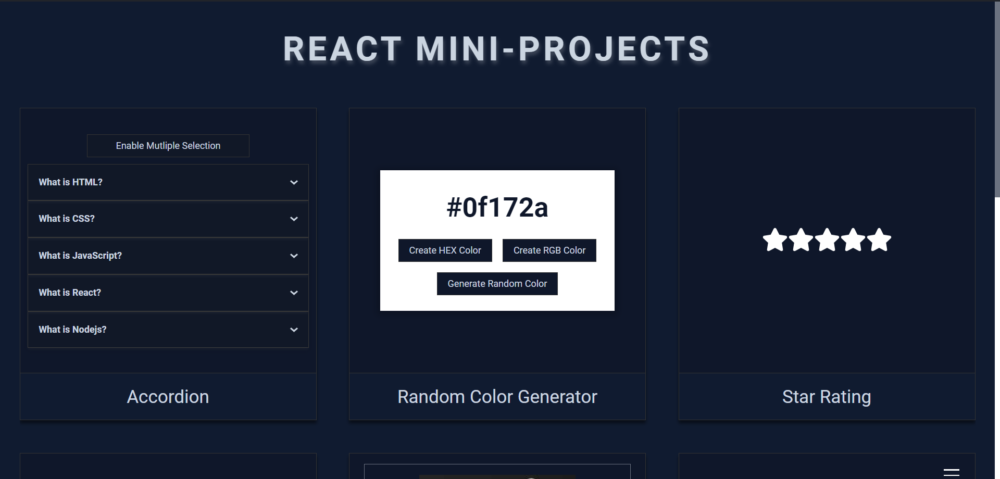

# React Mini-Projects

A collection of commonly used functional components for web development, built with React and Styled Components.

## Table of Contents

1.  Accordion

2.  Color Generator

3.  Star Rating

4.  Image Slider

5.  Load More

6.  Tree View

7.  Theme Switch

8.  Scroll Progress

9.  Tabs

10. Modal

## Installation

1. Clone this repository on your local machine.

2. Install dependencies: `npm install`

3. Start the development server: `npm run dev`

4. Open your web browser and visit `http://localhost:3000` to access the application.

## License

## Contributions

Contributions are welcome! If you have additional components or improvements to existing ones, feel free to submit a pull request.
